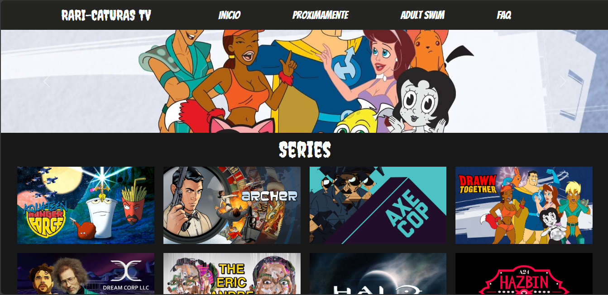
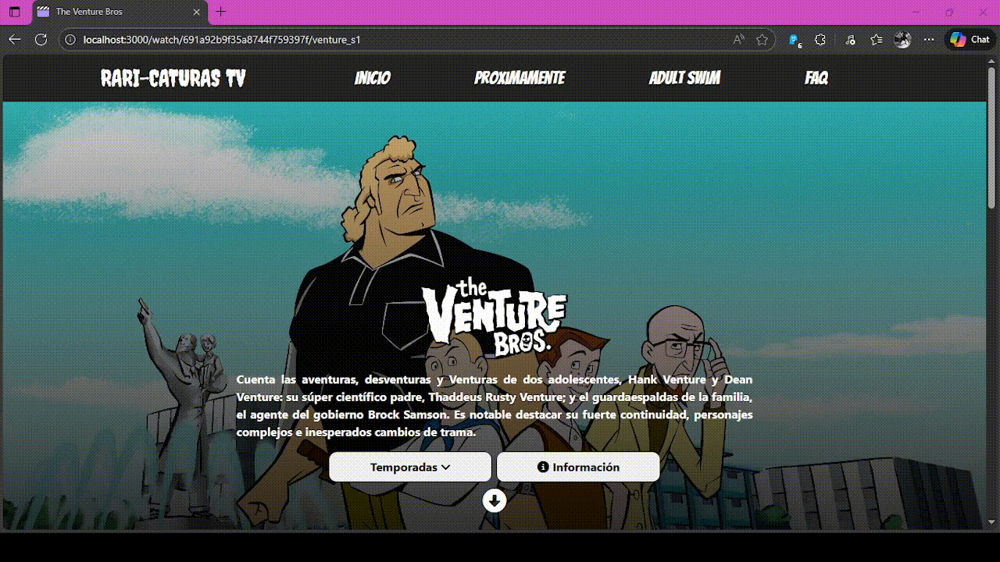
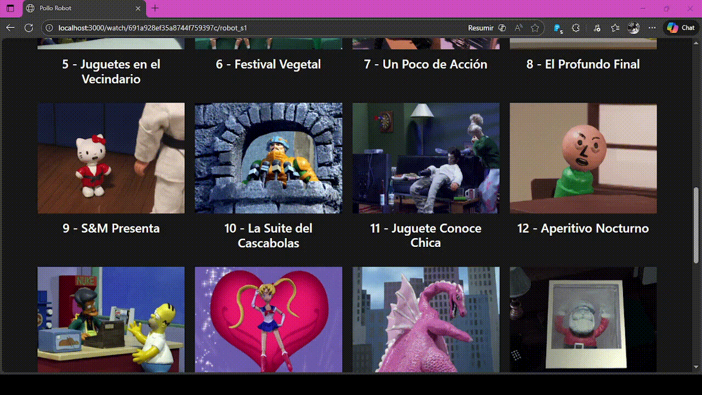
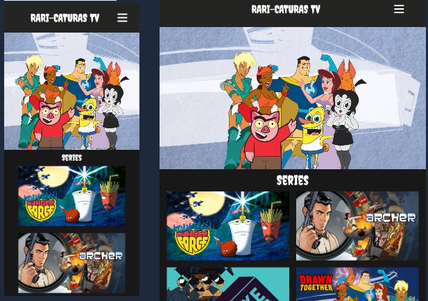
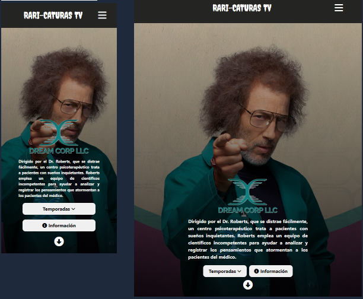

# 📺 Rari-Caturas-TV

Sitio web para ver diferentes series del canal Adult Swim entre otros canales. Enfocado en series de animación para adultos.

## Proximas funcionalidades
- Pantalla de carga
- Nuevo footer
- Fix de banner principal
- Manejo de errores
- Efectos de hover
- Nuevos estilos en modales
- Opciones de capitulo en español o inglés

# Descripción
La página cuenta con un carrusel en el cual se muestran las series recomendadas con la opción de ir a verla. 

Tambien cuenta con una sección donde se muestran las demás series con las que cuenta la página.

### Temporadas

Cada una de las series cuenta con su propia página en donde se encuentran las temporadas y capitulos disponibles. 

Como se puede observar se tiene una sección de las temporadas y la opción de "Información" la cual muestra todo lo relevante a la serie, desde la resolución, idioma y peso de cada capitulo. Asimismo, tiene un botón para descargar la temporada seleccionada.

### Capitulos

Cada capitulo tiene su propia página en donde se puede visualizar, así como controles para moverse al siguiente o anterior capitulo o regresar a la temporada seleccionada.

### Responsive

Tambien se cuenta con una versión responsive para celulares y tabletas.

## Autores
[ Salvador Gutiérrez Olvera](https://github.com/Salvador-97)